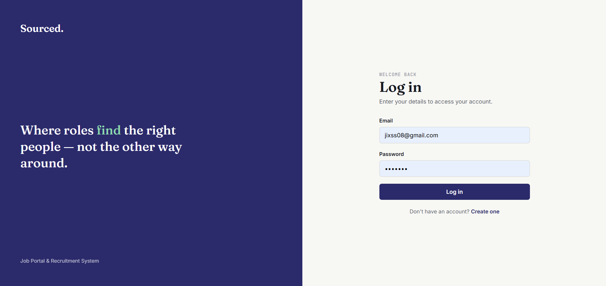
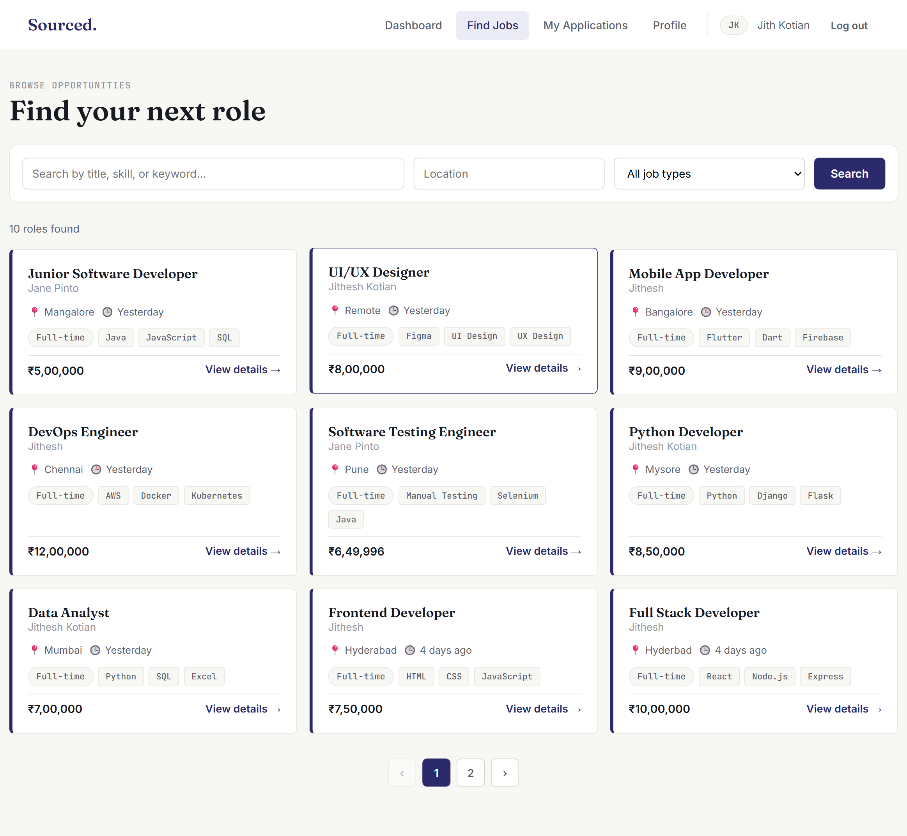
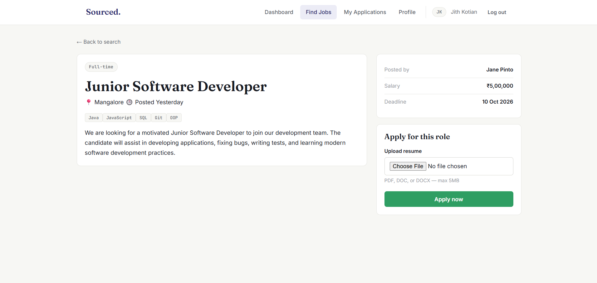
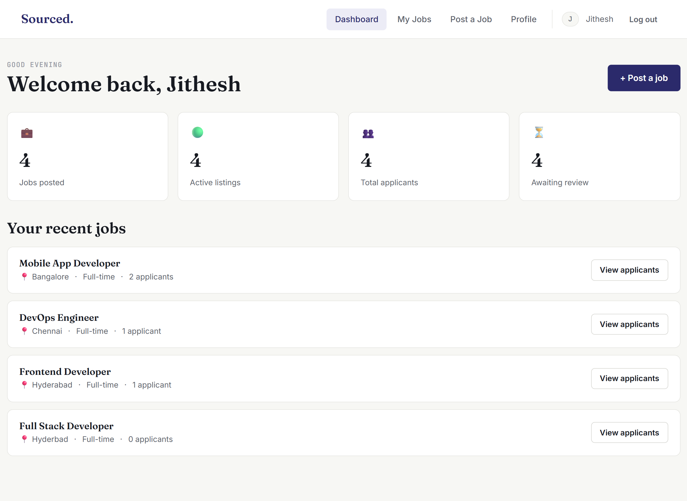
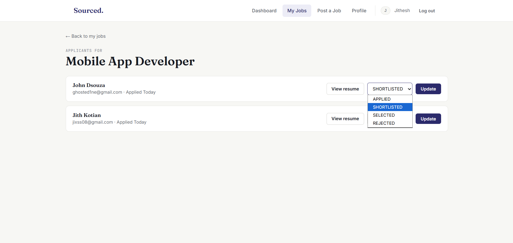

# Sourced — Job Portal & Recruitment System

A full-stack, role-based recruitment platform where candidates can search and apply for jobs, and recruiters can manage postings and review applicants — built to demonstrate a layered Spring Boot backend, JWT authentication, and a hand-built responsive frontend.

## Features

**Candidates**
- Register/login with role-based access
- Search and filter jobs by keyword, location, and job type (paginated)
- View full job details and apply with a resume upload (PDF/DOC/DOCX)
- Track application status (Applied, Shortlisted, Selected, Rejected)
- Manage profile details

**Recruiters**
- Post, edit, and delete job listings
- Dashboard with aggregate stats (jobs posted, active listings, total applicants, pending review)
- View applicants per job with resume access
- Update application status — triggers an automated email notification to the candidate

## Tech Stack

- **Backend:** Java 17, Spring Boot 3, Spring Security (JWT), Spring Data JPA, MySQL
- **Frontend:** HTML, CSS, vanilla JavaScript (no framework)
- **Auth:** Stateless JWT-based authentication with role-based authorization
- **Other:** Spring Mail (SMTP notifications), multipart file upload for resumes

## Project Structure

```
job-portal/
├── src/main/java/com/jobportal/job_portal_backend/
│ ├── config/ # Security & CORS configuration
│ ├── controller/ # REST endpoints
│ ├── dto/ # Request/response objects
│ ├── entity/ # JPA entities
│ ├── exception/ # Custom exceptions + global handler
│ ├── repository/ # Spring Data JPA repositories
│ ├── security/ # JWT filter, token utils, auth context
│ └── service/ # Business logic (interfaces + impl/)
│
├── job-portal-frontend/
│ ├── css/ # Shared design system
│ ├── js/ # One JS file per page + shared api/utils/navbar
│ └── *.html # Auth, candidate, and recruiter pages
│
├── uploads/resumes/ # Uploaded resume files (gitignored)
├── screenshots/ # README images
├── pom.xml
└── README.md
```

Layered backend architecture (controller → service → repository) with JWT-based role authorization for candidates and recruiters. See the API table above for key endpoints.

## Setup

### Prerequisites
- JDK 17+
- MySQL 8+
- Python 3 (to serve the frontend locally)

### Backend
1. Create the database:
```sql
   CREATE DATABASE job_portal_db;
```
2. Configure `src/main/resources/application.properties` with your MySQL credentials and a Gmail App Password for email notifications.
3. Run the app:
```bash
   mvn spring-boot:run
```
Backend runs on `http://localhost:8080`.

### Frontend
```bash
cd job-portal-frontend
python -m http.server 5500
```
Open `http://localhost:5500/login.html`. Make sure the backend is running first.

## API Overview

| Method | Endpoint | Description |
|---|---|---|
| POST | `/api/auth/register` | Register a new user |
| POST | `/api/auth/login` | Log in, returns JWT |
| GET | `/api/jobs/search` | Public paginated job search |
| POST | `/api/recruiter/jobs` | Create a job (recruiter only) |
| POST | `/api/candidate/applications/{jobId}` | Apply to a job with resume upload |
| GET | `/api/recruiter/jobs/{jobId}/applications` | View applicants for a job |
| PUT | `/api/recruiter/applications/{id}/status` | Update application status |
| GET/PUT | `/api/profile` | View/update user profile |

## Screenshots







## Future Improvements
- Close/reopen job listings without deleting them
- In-app notifications alongside email
- Cloud storage (S3) for resumes instead of local disk